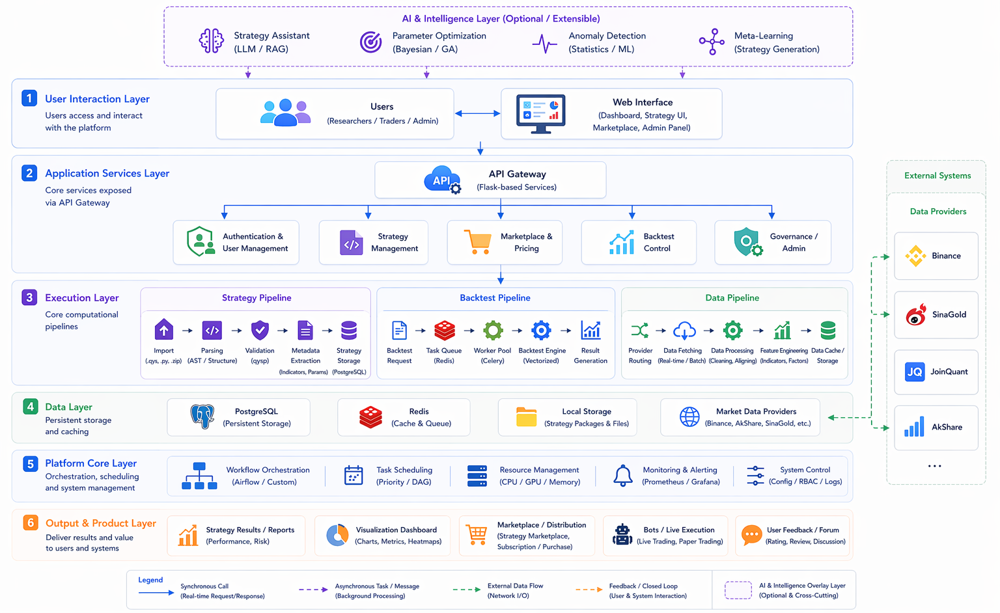

<div align="center">
  

  <h1>QYQuant</h1>

  <p><strong>A quant platform workspace for strategy packaging, market data access, asynchronous backtesting, and productized operations</strong></p>

  <p>
    <a href="./README.md">中文</a>
    ·
    <a href="#executive-summary">Executive Summary</a>
    ·
    <a href="#capability-matrix">Capability Matrix</a>
    ·
    <a href="#system-architecture">Architecture</a>
    ·
    <a href="#deployment-models">Deployment</a>
  </p>

  <p>
    
    
    
    
    
    
    
    
  </p>
</div>

## Executive Summary

QYQuant is a full-stack quant platform workspace. Its goal is not to provide only a backtest page or a strategy uploader, but to establish a productizable operating model for quant teams:

- turn strategies into standardized, packageable, validatable assets
- support both fast synchronous backtests and queued asynchronous jobs
- abstract market data behind switchable providers and cache-aware routing
- expose the platform through a product shell that includes strategy library, marketplace, pricing, forum, bots, and admin surfaces

In practical terms, the repository already contains a meaningful platform core plus a product shell. It is suitable as the foundation for an internal quant platform, a strategy operations console, or an early-stage quant SaaS product.

## Target Use Cases

QYQuant is currently best aligned with:

- quant research teams that need a standardized strategy packaging and execution flow
- product teams turning research workflows into a customer-facing console
- platform teams that need async execution, governance, review, and quota control
- integration teams that need a unified connector layer for data providers and accounts

Its value is strongest when the goal is to unify research, operations, marketplace, and admin capabilities in a single platform rather than to optimize a single script workflow.

## Capability Matrix

| Domain | What exists today | Platform value |
| --- | --- | --- |
| Strategy protocol | `.qys` / `.zip` import, manifest validation, entrypoint detection, integrity checks | Converts strategies from loose code into governed assets |
| Strategy workflow | Strategy creation, parameter handling, presets, runtime metadata | Lowers reuse and onboarding cost for strategy delivery |
| Backtesting | `latest` sync backtests, Celery async jobs, report export | Supports both fast debugging and production-style queued execution |
| Market data | `auto`, `sinagold`, `binance`, `freegold`, `joinquant`, `akshare` | Allows routing across providers, markets, and network environments |
| Marketplace | Listing, detail, import, publish request, reporting | Creates the base loop for strategy distribution and moderation |
| Monetization | Pricing, checkout, payment orders, subscription state, quota management | Supports product packaging and service-tier monetization |
| Integrations | Provider catalog, account connection, credential validation, account and positions lookup | Establishes a unified integration surface for brokers and providers |
| Governance | Admin console, data-source health, queue monitoring, strategy review, report handling, user bans, audit logs | Gives operators the controls expected from a platform |
| Authentication | SMS-code login, email registration/login, password reset, JWT access and refresh flows | Provides the baseline access-control layer for product access |
| Internationalization | Chinese and English UI plus bilingual README | Supports multi-language collaboration and presentation |

## Current State

QYQuant is beyond a demo, but it should still be treated as a platform core moving toward production, not as a fully signed-off enterprise product.

| Dimension | Assessment |
| --- | --- |
| Product completeness | Multi-page product shell and core business flows already exist |
| Platform depth | Data, jobs, moderation, quota, subscription, and notification primitives are present |
| Extensibility | High; module boundaries and workspace layout are suitable for team customization |
| Direct production readiness | Requires production hardening before real enterprise rollout |

## System Architecture

QYQuant uses a decoupled frontend, API, and async execution model. The Vue 3 frontend acts as the unified workspace, Flask exposes application APIs, Celery + Redis runs queued backtests, `qysp` standardizes strategy packaging, and provider routing abstracts market data sources.




## Workspace Map

| Area | Main paths | Purpose |
| --- | --- | --- |
| Frontend | `frontend/src/views`, `frontend/src/router`, `frontend/src/stores` | Product workspace, navigation, state, and API client layer |
| Backend API | `backend/app/blueprints` | Business entrypoints for auth, strategies, marketplace, backtests, payments, integrations, admin, and community features |
| Execution and runtime | `backend/app/backtest`, `backend/app/tasks`, `backend/app/strategy_runtime` | Backtest engine, async jobs, strategy runtime |
| Data access | `backend/app/marketdata`, `backend/app/providers`, `backend/app/services` | Data-provider wrappers and service abstractions |
| Platform core | `backend/app/models.py`, `backend/app/quota.py`, `backend/app/extensions.py` | Data model, quotas, and infrastructure bootstrap |
| Strategy protocol | `packages/qysp` | `qys` CLI, templates, packaging, migration, validation |
| Docs and specs | `docs`, `openspec` | Documentation, examples, and evolving specifications |

## Deployment Models

QYQuant supports two practical deployment modes:

- integrated container deployment for demos, testing, and quick environment setup
- developer mode deployment for local iteration and modular team workflows

### Option A: Integrated Docker deployment

Requirements:

- Docker Engine / Docker Desktop
- Docker Compose v2

```bash
git clone https://github.com/MapleQiAN/QYQuant.git
cd QYQuant
cp .env.example .env
docker compose up -d --build
```

Optional helper scripts:

```bash
./deploy.sh
```

```powershell
.\deploy.ps1
```

Default endpoints:

- Web: [http://127.0.0.1:58888](http://127.0.0.1:58888)
- API: [http://127.0.0.1:59999](http://127.0.0.1:59999)
- Swagger UI: [http://127.0.0.1:59999/api/docs](http://127.0.0.1:59999/api/docs)

Useful commands:

```bash
docker compose ps
docker compose logs -f backend
docker compose logs -f frontend
docker compose logs -f celery-worker
docker compose down
```

### Option B: Developer mode deployment

Requirements:

| Dependency | Version |
| --- | --- |
| Python | 3.11+ |
| Node.js | 18+ |
| PostgreSQL | 15+ |
| Redis | 7+ |
| uv | 0.4+ |

```bash
git clone https://github.com/MapleQiAN/QYQuant.git
cd QYQuant
cp .env.example .env.development
uv sync --dev
uv run --package qyquant-backend flask --app app db upgrade
uv run --package qyquant-backend flask --app app run --debug --port 59999
```

Run the worker in another terminal:

```bash
uv run --package qyquant-backend celery -A app.celery_app worker --loglevel=info
```

If scheduled jobs are needed:

```bash
uv run --package qyquant-backend celery -A app.celery_app beat --loglevel=info
```

Start the frontend:

```bash
cd frontend
npm install
npm run dev
```

If you only want infra dependencies through Docker:

```bash
docker compose up -d postgres redis
```

## Operations and Configuration

See [.env.example](./.env.example) for the full configuration surface. The most important groups are:

| Category | Key variables |
| --- | --- |
| App security | `SECRET_KEY`, `JWT_SECRET`, `FERNET_KEY`, `CORS_ORIGINS` |
| Database and cache | `DATABASE_URL`, `REDIS_URL`, `CELERY_BROKER_URL`, `CELERY_RESULT_BACKEND` |
| Backtests and data | `BACKTEST_DATA_PROVIDER`, `BACKTEST_INTERVAL`, `SINA_GOLD_*`, `BINANCE_*`, `FREEGOLD_*`, `JQDATA_*` |
| Async execution | `CELERYD_CONCURRENCY`, `CELERY_TASK_SOFT_TIME_LIMIT`, `CELERY_TASK_TIME_LIMIT` |
| Auth controls | `AUTH_FIXED_SMS_CODE`, `AUTH_SMS_CODE_TTL`, `AUTH_SMS_THROTTLE_SECONDS`, `AUTH_SMS_MAX_FAILURES`, `AUTH_SMS_LOCK_SECONDS` |
| Monetization | `PAYMENT_SANDBOX` |

## Market Data and Backtest Providers

| Provider | Best for | Default interval | Notes |
| --- | --- | --- | --- |
| `auto` | Default mode | gold `1d` / others `1m` | Gold-like symbols route to `sinagold`, others to `binance` |
| `sinagold` | Gold market data | `1d` | Better aligned with China-based network environments |
| `binance` | Crypto assets | `1m` | Supports cached klines and latest-price lookups |
| `freegold` | Gold market data | `1d` | Only supports gold-related symbols |
| `joinquant` | China-market daily research | `1d` | Requires JoinQuant credentials |
| `akshare` | China-localized market data | `1d` | Supports daily, weekly, and monthly history |
| `mock` | Test mode | `1m` | Intended for test suites and fake-data flows |

## Platform API Surface

| Module | Key routes |
| --- | --- |
| Health | `GET /api/health` |
| Auth | `POST /api/v1/auth/send-code`, `POST /api/v1/auth/login`, `POST /api/v1/auth/refresh`, `POST /api/v1/auth/logout` |
| Users | `GET /api/v1/users/me`, `PATCH /api/v1/users/me`, `DELETE /api/v1/users/me` |
| Strategies | `POST /api/strategies`, `POST /api/strategies/import`, `GET /api/strategies/recent`, `GET /api/strategies/<strategy_id>/runtime` |
| Backtests | `POST /api/backtests/run`, `GET /api/backtests/job/<job_id>`, `GET /api/backtests/latest`, `GET /api/v1/backtest/quota`, `GET /api/v1/backtest/<job_id>`, `POST /api/v1/backtest/` |
| Marketplace | `GET /api/v1/marketplace/strategies`, `GET /api/v1/marketplace/strategies/<strategy_id>`, `POST /api/v1/marketplace/strategies`, `POST /api/v1/marketplace/strategies/<strategy_id>/import` |
| Payments | `GET /api/v1/payments/me/subscription`, `GET /api/v1/payments/me/orders`, `POST /api/v1/payments/orders` |
| Integrations | `GET /api/v1/integrations/providers`, `GET /api/v1/integrations`, `POST /api/v1/integrations`, `POST /api/v1/integrations/<integration_id>/validate` |
| Bots | `GET /api/bots/recent`, `POST /api/bots`, `PATCH /api/bots/<bot_id>/status`, `GET /api/bots/<bot_id>/performance` |
| Forum | `GET /api/forum/hot`, `POST /api/forum/posts` |
| Admin | `/api/v1/admin/*` for review, moderation, queue monitoring, data-source health, user management, and audit access |

Swagger UI:

- [http://127.0.0.1:59999/api/docs](http://127.0.0.1:59999/api/docs)

## `qys` CLI

`packages/qysp` provides the strategy protocol CLI for initializing, validating, packaging, and migrating strategy assets.

Common commands:

- `qys init <name> --template trend-following|mean-reversion|momentum|multi-indicator`
- `qys validate <path>`
- `qys build <source_dir> -o <output.qys>`
- `qys migrate <path>`
- `qys import <path>`
- `qys backtest <path>` as a reserved stub

Help:

```bash
uv run qys --help
```

## Quality and Testing

Backend:

```bash
uv run pytest backend/tests -q
```

Frontend:

```bash
cd frontend
npm test
```

Recommended pre-submit checks:

```bash
uv run pytest backend/tests -q
cd frontend && npm test
```

## Production Rollout Notes

If QYQuant is being prepared as an enterprise delivery target, the following should be treated as rollout prerequisites rather than optional polish:

1. Disable the fixed development SMS code.
   Remove `AUTH_FIXED_SMS_CODE` from production and connect a real verification or enterprise auth channel.
2. Replace sandbox payments.
   `PAYMENT_SANDBOX` is currently biased toward integration/testing workflows and is not a production payment path.
3. Close the temporary frontend admin bypass.
   The frontend router still contains a temporary `/admin` test bypass and it should be removed before production launch.
4. Harden secrets and origin controls.
   Use real secret management for `SECRET_KEY`, `JWT_SECRET`, and `FERNET_KEY`, and restrict `CORS_ORIGINS`.
5. Establish formal storage and observability operations.
   PostgreSQL, Redis, strategy storage, task logs, alerts, and backup workflows should all be productionized.

This section belongs in the README because an enterprise-grade README should define operational truth, not just polished positioning.

## Project Structure

```text
QYQuant/
|- frontend/               # Vue 3 workspace frontend
|- backend/                # Flask API, jobs, backtests, runtime, admin features
|- packages/qysp/          # Strategy protocol, templates, and CLI
|- docs/                   # Documentation and format guides
|- openspec/               # Change proposals and specifications
|- .gitnexus/              # GitNexus index metadata
|- .env.example            # Environment template
|- docker-compose.yml      # Integrated deployment orchestration
```

## Roadmap

The next high-value investment areas are:

- managed strategy execution and account binding
- richer backtest analytics and comparison workflows
- stronger strategy marketplace distribution and moderation features
- clearer quota, subscription, and monetization models
- production-grade security and observability hardening

## Contributing

Issues and pull requests are welcome. For larger product, architecture, or business changes, document intent and scope before implementation.

## License

This project is licensed under the MIT License.
