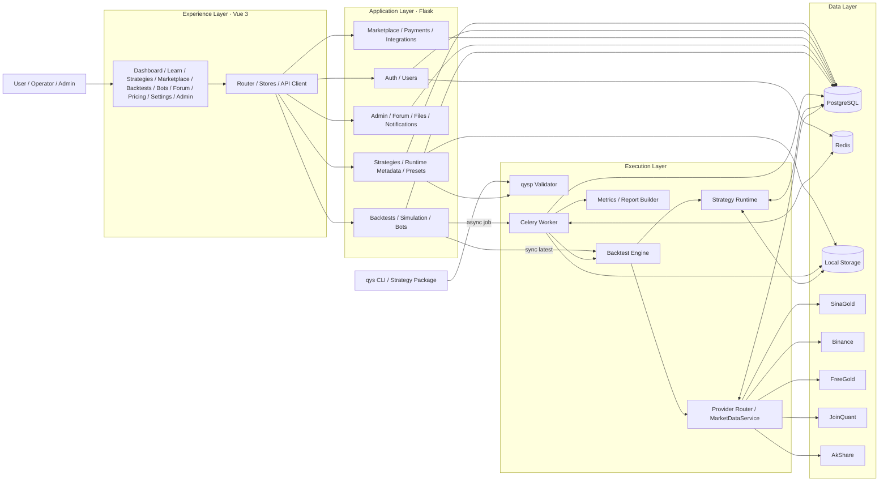

<div align="center">
  

  <h1>QYQuant</h1>

  <p><strong>面向量化团队的策略研发、数据接入、异步回测与产品化运营工作台</strong></p>

  <p>
    <a href="./README.en.md">English</a>
    ·
    <a href="#执行摘要">执行摘要</a>
    ·
    <a href="#核心能力矩阵">能力矩阵</a>
    ·
    <a href="#系统架构">系统架构</a>
    ·
    <a href="#部署模式">部署模式</a>
  </p>

  <p>
    
    
    
    
    
    
    
    
  </p>
</div>

## 执行摘要

QYQuant 是一个全栈量化平台工作台，核心目标不是单独提供某一个回测脚本或策略页面，而是提供一条可产品化、可运营、可扩展的量化业务链路：

- 将策略标准化为可打包、可导入、可校验的交付对象
- 将回测从本地同步执行扩展到可排队、可追踪的异步任务体系
- 将市场数据接入抽象为可切换、可缓存的多提供方模型
- 将研发能力包装为可交互的产品界面，包括策略库、策略市场、定价、论坛、机器人与管理后台

从当前仓库状态看，QYQuant 已具备“平台内核 + 产品壳”的基础形态，适合继续向团队内部平台、策略服务平台或量化 SaaS 原型演进。

## 适用场景

QYQuant 当前更适合以下类型的团队与场景：

- 量化研发团队：统一策略模板、包格式、运行前检查与回测入口
- 产品化团队：将策略研发能力包装为前后台一体的运营型产品
- 数据接入团队：管理不同市场数据提供方及缓存策略
- 平台工程团队：搭建支持异步任务、后台审核、用户配额与订阅的量化平台底座

如果你的目标是“企业级平台首页”，QYQuant 的强项不是单一算法能力，而是研发、产品、运营、市场和后台治理可以共存于同一个系统中。

## 核心能力矩阵

| 能力域 | 当前已实现 | 企业价值 |
| --- | --- | --- |
| 策略协议 | `.qys` / `.zip` 导入、清单校验、入口检测、完整性校验 | 将策略从“代码文件”升级为“标准化资产” |
| 策略研发工作流 | 新建策略、参数管理、参数预设、运行时元信息读取 | 降低策略交付和复用成本 |
| 回测执行 | `latest` 同步回测、Celery 异步回测、任务状态查询、结果报告导出 | 支持从快速调试到正式任务执行的双模式 |
| 数据接入 | `auto` / `sinagold` / `binance` / `freegold` / `joinquant` / `akshare` | 支持不同市场、网络环境与数据质量策略 |
| 策略市场 | 策略列表、详情、导入、发布申请、举报处理 | 为策略分发和审核闭环提供产品基础 |
| 商业化链路 | Pricing、Checkout、支付订单、订阅状态、配额管理 | 支撑按套餐、配额或服务等级商业化 |
| 集成体系 | 提供商目录、账户接入、凭证校验、账户与持仓读取 | 为券商、账户系统、第三方服务留出统一接入面 |
| 平台治理 | 管理后台、数据源健康、回测队列监控、策略审核、举报处理、用户封禁、审计日志 | 提供面向运营与平台管理员的治理面 |
| 用户认证 | 手机验证码登录、邮箱注册/登录、密码重置、JWT 访问令牌、刷新令牌轮换 | 满足多终端产品化访问控制基础 |
| 国际化 | 中文 / English 双语界面与双语 README | 支持跨语言展示与协作 |

## 当前状态

QYQuant 已经超出“Demo”阶段，但仍应被视为一个正在走向生产的产品内核，而不是已经完成企业交付验收的成品平台。

| 维度 | 当前判断 |
| --- | --- |
| 产品完整度 | 已具备多页面产品壳、前后台角色和核心业务流 |
| 平台能力 | 已具备数据、任务、审核、订阅、通知等基础平台要素 |
| 二次开发适配性 | 高，目录结构和模块边界清晰，适合作为团队内部平台底座 |
| 直接生产可用性 | 需补充上线前治理与安全收口，不建议未经审查直接商用上线 |

## 系统架构

QYQuant 采用前后端分离与异步任务解耦架构。前端基于 Vue 3 构建统一工作台；后端基于 Flask 暴露业务 API；回测任务由 Celery + Redis 调度；策略包通过 `qysp` 协议进行结构化导入和验证；市场数据通过提供方路由进行抽象；后台治理能力集中在管理蓝图中。



## 模块版图

| 区域 | 主要目录 | 说明 |
| --- | --- | --- |
| Frontend | `frontend/src/views`, `frontend/src/router`, `frontend/src/stores` | 工作台页面、导航、状态管理、API 调用 |
| Backend API | `backend/app/blueprints` | 认证、策略、回测、市场、支付、集成、管理、论坛等业务入口 |
| 执行与回测 | `backend/app/backtest`, `backend/app/tasks`, `backend/app/strategy_runtime` | 回测引擎、异步任务、策略运行时 |
| 数据接入 | `backend/app/marketdata`, `backend/app/providers`, `backend/app/services` | 统一的数据提供方封装与服务层 |
| 平台内核 | `backend/app/models.py`, `backend/app/quota.py`, `backend/app/extensions.py` | 数据模型、配额、扩展初始化 |
| 策略协议 | `packages/qysp` | `qys` CLI、模板、打包、迁移、校验 |
| 文档与规格 | `docs`, `openspec` | 文档、格式说明、示例、规格演进 |

## 部署模式

QYQuant 支持两类部署方式：

- 一体化容器部署：适合演示环境、测试环境、快速验证
- 开发模式部署：适合本地开发、调试和模块化迭代

### 方案 A：Docker 一体化部署

前提：

- Docker Engine / Docker Desktop
- Docker Compose v2

步骤：

```bash
git clone https://github.com/MapleQiAN/QYQuant.git
cd QYQuant
cp .env.example .env
docker compose up -d --build
```

可选脚本：

```bash
./deploy.sh
```

```powershell
.\deploy.ps1
```

默认入口：

- Web: [http://127.0.0.1:58888](http://127.0.0.1:58888)
- API: [http://127.0.0.1:59999](http://127.0.0.1:59999)
- Swagger UI: [http://127.0.0.1:59999/api/docs](http://127.0.0.1:59999/api/docs)

常用命令：

```bash
docker compose ps
docker compose logs -f backend
docker compose logs -f frontend
docker compose logs -f celery-worker
docker compose down
```

### 方案 B：开发模式部署

前提：

| 依赖 | 版本 |
| --- | --- |
| Python | 3.11+ |
| Node.js | 18+ |
| PostgreSQL | 15+ |
| Redis | 7+ |
| uv | 0.4+ |

步骤：

```bash
git clone https://github.com/MapleQiAN/QYQuant.git
cd QYQuant
cp .env.example .env.development
uv sync --dev
uv run --package qyquant-backend flask --app app db upgrade
uv run --package qyquant-backend flask --app app run --debug --port 59999
```

另启终端运行 Worker：

```bash
uv run --package qyquant-backend celery -A app.celery_app worker --loglevel=info
```

如需定时任务：

```bash
uv run --package qyquant-backend celery -A app.celery_app beat --loglevel=info
```

启动前端：

```bash
cd frontend
npm install
npm run dev
```

本地依赖也可以仅用 Docker 启动：

```bash
docker compose up -d postgres redis
```

## 运维与配置

关键环境变量可参考根目录 [.env.example](./.env.example)。推荐至少关注以下类别：

| 类别 | 关键变量 |
| --- | --- |
| 应用安全 | `SECRET_KEY`, `JWT_SECRET`, `FERNET_KEY`, `CORS_ORIGINS` |
| 数据库与缓存 | `DATABASE_URL`, `REDIS_URL`, `CELERY_BROKER_URL`, `CELERY_RESULT_BACKEND` |
| 回测与数据 | `BACKTEST_DATA_PROVIDER`, `BACKTEST_INTERVAL`, `SINA_GOLD_*`, `BINANCE_*`, `FREEGOLD_*`, `JQDATA_*` |
| 任务执行 | `CELERYD_CONCURRENCY`, `CELERY_TASK_SOFT_TIME_LIMIT`, `CELERY_TASK_TIME_LIMIT` |
| 认证控制 | `AUTH_FIXED_SMS_CODE`, `AUTH_SMS_CODE_TTL`, `AUTH_SMS_THROTTLE_SECONDS`, `AUTH_SMS_MAX_FAILURES`, `AUTH_SMS_LOCK_SECONDS` |
| 商业化 | `PAYMENT_SANDBOX` |

## 数据源与回测提供方

| 提供方 | 适用场景 | 默认周期 | 说明 |
| --- | --- | --- | --- |
| `auto` | 默认模式 | 黄金 `1d` / 其他 `1m` | 黄金符号默认路由到 `sinagold`，其他路由到 `binance` |
| `sinagold` | 黄金行情 | `1d` | 更适合中国网络环境的免费黄金数据 |
| `binance` | 加密资产 | `1m` | 支持 K 线和最新价缓存 |
| `freegold` | 黄金行情 | `1d` | 仅支持黄金相关符号 |
| `joinquant` | A 股 / 日线研究 | `1d` | 依赖 JoinQuant 账号配置 |
| `akshare` | A 股等本地化数据 | `1d` | 支持日 / 周 / 月级别历史数据 |
| `mock` | 测试环境 | `1m` | 用于自动化测试或本地假数据 |

## 平台接口面

| 模块 | 关键接口 |
| --- | --- |
| Health | `GET /api/health` |
| Auth | `POST /api/v1/auth/send-code`, `POST /api/v1/auth/login`, `POST /api/v1/auth/refresh`, `POST /api/v1/auth/logout` |
| Users | `GET /api/v1/users/me`, `PATCH /api/v1/users/me`, `DELETE /api/v1/users/me` |
| Strategies | `POST /api/strategies`, `POST /api/strategies/import`, `GET /api/strategies/recent`, `GET /api/strategies/<strategy_id>/runtime` |
| Backtests | `POST /api/backtests/run`, `GET /api/backtests/job/<job_id>`, `GET /api/backtests/latest`, `GET /api/v1/backtest/quota`, `GET /api/v1/backtest/<job_id>`, `POST /api/v1/backtest/` |
| Marketplace | `GET /api/v1/marketplace/strategies`, `GET /api/v1/marketplace/strategies/<strategy_id>`, `POST /api/v1/marketplace/strategies`, `POST /api/v1/marketplace/strategies/<strategy_id>/import` |
| Payments | `GET /api/v1/payments/me/subscription`, `GET /api/v1/payments/me/orders`, `POST /api/v1/payments/orders` |
| Integrations | `GET /api/v1/integrations/providers`, `GET /api/v1/integrations`, `POST /api/v1/integrations`, `POST /api/v1/integrations/<integration_id>/validate` |
| Bots | `GET /api/bots/recent`, `POST /api/bots`, `PATCH /api/bots/<bot_id>/status`, `GET /api/bots/<bot_id>/performance` |
| Forum | `GET /api/forum/hot`, `POST /api/forum/posts` |
| Admin | `/api/v1/admin/*`，覆盖策略审核、举报处理、数据源健康、用户管理、回测队列监控和审计查询 |

完整 API 文档可通过 Swagger UI 查看：

- [http://127.0.0.1:59999/api/docs](http://127.0.0.1:59999/api/docs)

## `qys` CLI

`packages/qysp` 提供了策略协议 CLI，适合将策略作为标准资产进行本地初始化、校验和打包。

常用命令：

- `qys init <name> --template trend-following|mean-reversion|momentum|multi-indicator`
- `qys validate <path>`
- `qys build <source_dir> -o <output.qys>`
- `qys migrate <path>`
- `qys import <path>`
- `qys backtest <path>`（当前为预留 stub）

查看帮助：

```bash
uv run qys --help
```

## 质量与测试

后端测试：

```bash
uv run pytest backend/tests -q
```

前端测试：

```bash
cd frontend
npm test
```

推荐在提交前至少执行：

```bash
uv run pytest backend/tests -q
cd frontend && npm test
```

## 生产落地注意事项

如果要把 QYQuant 包装成企业级交付物，以下事项应视为上线前必做项，而不是可选优化：

1. 关闭开发验证码。
   将 `AUTH_FIXED_SMS_CODE` 从生产环境移除，接入真实短信或企业内部认证通道。
2. 切换真实支付链路。
   当前 `PAYMENT_SANDBOX` 默认偏向联调与沙箱，不应直接作为生产支付实现。
3. 收口前端管理入口。
   当前前端路由中存在临时性的 `/admin` 测试绕过逻辑，上线前必须移除并与后端权限模型保持一致。
4. 强化密钥与来源控制。
   为 `SECRET_KEY`、`JWT_SECRET`、`FERNET_KEY` 使用正式密钥管理方案，并严格限制 `CORS_ORIGINS`。
5. 明确存储与观测策略。
   为 PostgreSQL、Redis、策略文件存储、任务日志、告警与备份建立正式运维方案。

这部分写进 README 的目的不是暴露问题，而是把“企业级”定义为可交付、可审计、可上线，而不是语气更正式。

## 项目结构

```text
QYQuant/
|- frontend/               # Vue 3 前端工作台
|- backend/                # Flask API、任务、回测、运行时、管理能力
|- packages/qysp/          # 策略协议、模板与 CLI
|- docs/                   # 文档与格式说明
|- openspec/               # 变更提案与规格
|- .gitnexus/              # GitNexus 索引元数据
|- .env.example            # 环境变量模板
|- docker-compose.yml      # 一体化部署编排
```

## Roadmap

下一阶段更值得投入的方向：

- 完整的策略托管执行与账户绑定链路
- 更细颗粒度的回测指标、报告与对比能力
- 更成熟的策略市场分发与审核运营体系
- 更清晰的套餐、配额、订阅和商业模型
- 更正式的生产安全收口与可观测体系

## Contributing

欢迎提交 Issue 和 Pull Request。对于较大范围的产品、架构或业务改动，建议先写明目标、边界和影响范围，再进入实现。

## License

This project is licensed under the MIT License.
