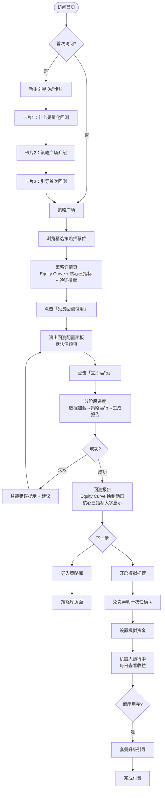
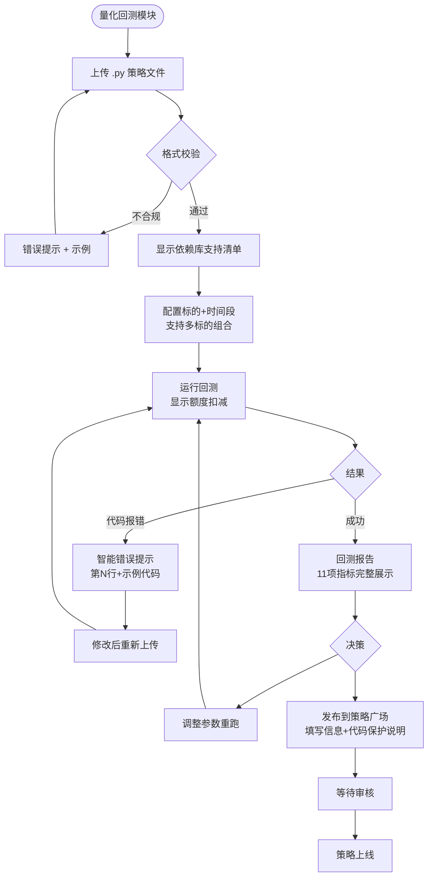
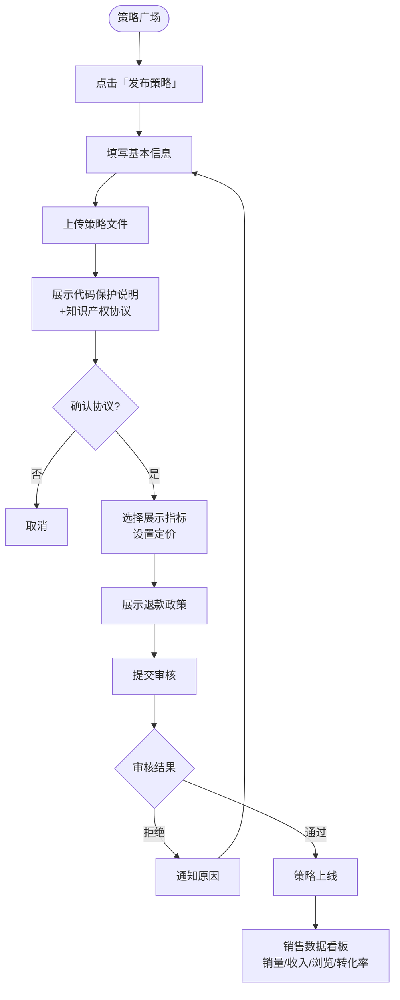

---
stepsCompleted:
  - step-01-init
  - step-02-discovery
  - step-03-core-experience
  - step-04-emotional-response
  - step-05-inspiration
  - step-06-design-system
  - step-07-defining-experience
  - step-08-visual-foundation
  - step-09-design-directions
  - step-10-user-journeys
  - step-11-component-strategy
  - step-12-ux-patterns
  - step-13-responsive-accessibility
  - step-14-complete
inputDocuments:
  - _bmad-output/planning-artifacts/prd.md
  - _bmad-output/planning-artifacts/prd-qystrategy-improvement.md
  - _bmad-output/planning-artifacts/architecture.md
---

# UX Design Specification QYQuant

**Author:** Serendy
**Date:** 2026-03-14

---

<!-- UX design content will be appended sequentially through collaborative workflow steps -->

## 执行摘要

### 项目愿景

QYQuant 是一个面向所有投资者的量化交易平台，核心定位是**"让完全不懂编程的人也能使用量化策略投资"**。策略即服务（Strategy-as-a-Service）是核心差异点——策略像 App Store 应用，用户一键选用、一键回测、一键模拟托管，无需写任何代码。

MVP 包含三大模块：量化回测引擎（核心）、策略广场（展示 + 社区）、模拟托管（不涉及真实资金）。商业化路径为免费 100 次/月回测额度获客，付费订阅（200/500/1000 元/月）变现。

### 目标用户

| 用户类型 | 代表人物 | 技术水平 | 核心诉求 |
|---------|---------|---------|---------|
| 量化小白散户 | 老王（50岁，50万闲钱） | 不会编程 | 零代码选策略→一键回测→模拟托管 |
| 量化爱好者/程序员 | 小明（27岁，IT工程师） | 会Python | 上传代码→优化参数→发布策略 |
| 策略开发者/卖家 | Lisa（全职量化） | 专业级 | 策略加密发布→变现→销售数据 |

### 关键设计挑战

1. **认知门槛**：小白用户不懂"回测"、"夏普比率"等专业概念，需要渐进式信息披露与上下文教育，避免一次性信息过载
2. **信任建立**：说服用户使用"别人的策略"——平台验证徽章与免责声明之间的平衡设计，既要建立信心，又要合规
3. **双轨界面设计**：策略开发者的上传/配置路径 vs 小白用户的一键体验路径，两类用户差异巨大，需要在统一视觉语言下支持截然不同的操作深度

### 设计机会

1. **Equity Curve 作为决策界面**：资金曲线图成为平台最具差异性的视觉锚点，让小白用户"一眼看懂"策略好坏，无需理解数字
2. **额度感知设计**：将"剩余回测次数"做成有温度的渐进引导，而非冷冰冰的计数器，在用户"刚好用完"的时刻自然驱动付费转化
3. **模拟托管作为留存钩子**：每日打开平台查看模拟收益，形成习惯性高频回访，为后续付费转化和真实资金托管打下用户粘性基础

## 核心用户体验

### 定义体验

QYQuant 最高频、最关键的用户动作是：

> **"选择一个策略 → 设置参数 → 点击运行 → 看到回测结果"**

这个"一键回测"闭环是整个产品的价值核心。如果这个动作做到极致流畅，其他一切都会跟着成立。

### 平台策略

- **Web 优先**（SPA），响应式支持桌面和移动端浏览器，MVP 不做原生 App
- **鼠标 + 键盘**为主要交互方式，移动端触摸作为次要支持
- 浏览器兼容：Chrome、Edge、Firefox、Safari 最新两个版本
- **无离线需求**（回测依赖服务端执行和数据源）

### 零摩擦交互

| 交互 | 为何必须无摩擦 |
|------|-------------|
| 策略广场→导入→回测（小白路径） | 这是核心价值主张，断点即流失 |
| 回测报告展示（Equity Curve 加载） | 等待后的"揭晓时刻"，必须震撼 |
| 额度提醒→升级套餐 | 付费转化的关键漏斗节点 |
| 新手引导（首次体验） | 首次成功率决定产品生死 |

### 关键成功时刻

1. **"啊哈时刻"**：新用户第一次看到回测报告，Equity Curve 一目了然——这是用户意识到"原来量化这么简单"的时刻
2. **"信任时刻"**：用户在策略详情页看到"平台验证回测"徽章 + 真实的资金曲线，决定是否值得一试
3. **"留存钩子时刻"**：模拟托管开启后，用户第二天再次打开平台查看模拟收益的那一刻
4. **"付费触发时刻"**：回测额度剩余 10 次时，用户主动点击升级的那个瞬间

### 体验原则

1. **"小白优先"** — 所有设计决策优先服务不会编程的用户；复杂功能渐进披露，而非一次性堆砌
2. **"数据可视化优于数字表格"** — Equity Curve 是第一公民；让用户用眼睛而不是大脑做判断
3. **"等待即体验"** — 回测运行期间不是死等，而是阶段进度提示；每一步都有反馈
4. **"信任由内而外"** — 平台验证机制、免责提示的设计，让用户感到被保护，而非被骚扰

## 期望情感反应

### 核心情感目标

| 用户 | 首要情感 | 次要情感 |
|------|---------|---------|
| 小白老王 | **被赋能** — "原来我也能做量化投资" | 安心、信任 |
| 爱好者小明 | **高效掌控** — "工具帮我省时间，让我专注策略本身" | 成就感、专业感 |
| 开发者 Lisa | **安全感 + 商业信心** — "我的策略受到保护，变现路径清晰" | 被认可、专业尊重 |

平台层面最重要的情感：**赋能感**（Empowerment）——让原本觉得量化遥不可及的人，感到"这是我能做到的事"。

### 情感旅程地图

| 阶段 | 期望情感 | 避免情感 |
|------|---------|---------|
| 首次访问/注册 | 好奇、轻松上手 | 困惑、被劝退 |
| 新手引导 | 被引导、有方向 | 迷失、不知所措 |
| 首次回测运行中 | 期待、好奇（等待是仪式感） | 焦虑、不知道是否在运行 |
| 看到回测报告 | 惊喜、"啊哈！"的顿悟感 | 看不懂、信息过载 |
| 模拟托管运行中 | 参与感、每日期待 | 被遗忘、静止感 |
| 遭遇错误/失败 | 被帮助、有解决路径 | 被责怪、迷茫 |
| 套餐升级 | 主动选择感、物有所值 | 被迫、被套路 |

### 关键微情感

- **信任 > 怀疑**：平台验证徽章、透明的指标说明、代码保护机制 → 用户相信平台是站在自己这边的
- **成就感 > 挫败感**：智能错误提示（不只是报错，而是给出下一步）、首次回测成功率设计
- **掌控感 > 不安感**：额度显示清晰、模拟托管状态实时可见、每步操作都有确认反馈
- **期待感 > 平淡感**：回测运行的进度动画、报告"揭晓"的视觉设计

### 情感→设计映射

| 期望情感 | UX 设计策略 |
|---------|-----------|
| 赋能感 | 新手引导"3步完成首次回测"，将复杂过程拆解为可完成的小步骤 |
| 信任感 | 平台验证徽章采用蓝色权威色；免责声明用小字灰色，不打扰主流程 |
| 惊喜感 | Equity Curve 加载完成后有轻微动画；核心三指标用大字醒目呈现 |
| 掌控感 | 剩余额度始终可见（导航栏）；模拟机器人状态用"心跳"图标表示运行中 |
| 期待感 | 回测执行期间分阶段显示"数据加载中 → 策略运行中 → 生成报告中" |
| 安全感 | 策略发布时主动展示"您的代码受沙箱保护"说明，而非隐藏 |

### 情感设计原则

1. **赋能而非炫技** — 每个专业术语旁都配有一句人话解释（tooltip），让小白感到被尊重而非被排除
2. **等待是仪式，不是煎熬** — 25秒回测时间用分阶段进度设计转化为"期待揭晓"的仪式感
3. **失败时不孤单** — 错误发生时，界面语气是"让我们一起解决这个问题"，而非冷冰冰的错误码
4. **成功值得庆祝** — 首次回测成功后，短暂的视觉庆祝动效（不夸张），强化"我做到了"的情感印记

## UX 模式分析与灵感

### 参考产品分析

**① TradingView — 金融数据可视化的标杆**
- 核心优势：图表交互极致流畅，缩放/拖拽/悬停 tooltip 做到行业最佳
- 信息层级：技术指标折叠展示，专业功能不干扰初级用户
- 可借鉴：Equity Curve 的交互设计模式；指标 tooltip 的展示方式

**② 币安（Binance）策略广场 — 内容卡片流**
- 核心优势：策略/信号卡片包含关键指标一目了然，支持快速扫描决策
- 可借鉴：策略卡片的信息密度设计；筛选标签布局
- 需适配：币安用深色主题，QYQuant 需保持白色主题

**③ Robinhood — 零门槛金融 App**
- 核心优势：将复杂金融操作简化到极致；数字大字展示，情绪化颜色反馈
- 新手引导：极简注册 → 立刻上手，无教程轰炸
- 可借鉴：收益/亏损的颜色语言；数字的大字优先级排版

**④ Notion — 渐进式复杂度设计**
- 核心优势：简单用户看到简洁界面，高级用户能发现更多功能层
- 可借鉴：功能折叠/展开模式；"高级设置"对小白隐藏的设计哲学

### 可移植的 UX 模式

**导航模式：**
- TradingView 的侧边功能栏 + 主图表区分离 → 适配回测报告页（左侧参数，右侧 Equity Curve）
- 顶部 Tab 导航（策略广场 / 回测 / 模拟托管）→ 三大模块快速切换

**交互模式：**
- 卡片悬停展开详情（币安风格）→ 策略广场卡片 hover 显示更多指标
- 分阶段进度条 → 回测执行中的"数据加载 → 策略运行 → 生成报告"

**视觉模式：**
- Robinhood 的"核心数字大字 + 次要信息小字"层级 → 核心三指标醒目展示
- 红涨绿跌颜色惯例（符合中文股市习惯）

### 反模式——要避免的设计错误

| 反模式 | 为何要避免 |
|--------|---------|
| 首屏塞满所有功能 | 小白用户进入即流失 |
| 错误提示只给错误码 | 完全无助于新手 |
| 强制完整教程才能使用 | 阻断即时价值体验 |
| 免责声明弹窗每次都弹 | 用户快速跳过，失去实际效果 |
| 指标不加解释直接展示 | 小白完全看不懂专业指标 |

### 设计灵感策略

**直接采用：**
- TradingView 的图表交互模式（Equity Curve 缩放/悬停）
- Robinhood 的数字层级排版（核心指标大字优先）
- 币安策略卡片的信息密度结构

**改造适配：**
- 币安深色主题 → 改为白色主题，保留卡片流布局结构
- TradingView 专业复杂侧栏 → 简化为仅展示关键参数，折叠高级选项

**明确回避：**
- 传统量化平台的"代码编辑器优先"界面
- 信息密度超高的专业仪表盘（认知负荷过重）
- 每次打开都强制弹出的免责声明

## 设计系统基础

### 设计系统选择

**自定义 CSS 设计令牌体系（延续现有架构，无 UI 组件库）**

现有代码为纯 Vue 3 + 自定义 CSS，无任何第三方 UI 框架。继续此路线，仅更新设计令牌颜色值以匹配新视觉风格，零新增依赖。

### 选择理由

1. **零新增依赖** — 现有无 UI 框架，继续此路线，无技术债和样式覆盖冲突
2. **设计令牌已完备** — CSS 变量体系成熟，只需更新颜色值，组件代码无需大改
3. **完全匹配目标设计稿** — 目标设计为纯自定义风格，无框架组件痕迹
4. **ECharts 集成不受影响** — K 线图保持现有实现

### 设计令牌更新方案

```css
/* 主色：红色（涨幅/强调/关键数据）*/
--color-primary: #E53935;
--color-primary-dark: #C62828;
--color-primary-bg: rgba(229, 57, 53, 0.08);

/* CTA：纯黑（主操作按钮）*/
--color-cta: #1A1A1A;
--color-cta-hover: #333333;

/* 导航激活态：黄色胶囊 */
--color-nav-active-bg: #F5E642;
--color-nav-active-text: #1A1A1A;

/* 涨跌颜色（A股惯例：红涨绿跌）*/
--color-up: #E53935;
--color-down: #26A69A;
```

### 视觉规范（来自设计稿）

| 元素 | 规范 |
|------|------|
| 导航标签 | 胶囊形 Pill，活跃态黄色背景 `#F5E642` |
| 卡片 | 白色背景 + 1px 细边框 `#E5E5E5` + 极轻阴影 |
| 主背景 | 极浅灰 `#F5F5F5` / `#F8FAFC` |
| 表单输入 | 浅灰背景 `#F5F5F5`，无明显边框 |
| CTA 按钮 | 纯黑 `#1A1A1A`，圆角 `8px` |
| 数字层级 | 核心数字大字加粗，次要信息小字灰色 |
| 字体 | Inter / -apple-system / PingFang SC |

### 定制策略

**直接延用：** 现有 CSS 变量结构、间距系统、圆角系统、阴影变量

**需要更新：** 主色调（紫→红）、导航激活色（紫背景→黄色胶囊）、CTA 按钮色（紫→黑）

**新增变量：** `--color-cta`、`--color-nav-active-bg`、`--color-nav-active-text`

## 核心交互体验定义

### 定义性体验

**「选一个策略，25 秒后看到它跑赢大盘的曲线」**

这是用户会告诉朋友的那句话。不是"我用了量化平台"，而是"我选了一个策略，25 秒就看到结果了，太简单了"。

### 用户心智模型

| 用户 | 带来的心智模型 | 期望 | 易困惑点 |
|------|-------------|------|---------|
| 老王（小白） | 类似"选基金" — 看图选、点击购买 | 选完就能跑，不用懂代码 | 为什么要设置时间段？什么是标的？ |
| 小明（爱好者） | 类似 Jupyter Notebook 回测 | 上传代码→配参数→看结果 | 额度如何计算？支持哪些库？ |
| Lisa（开发者） | 类似 App Store 上架 | 填信息→上传→等审核→看销量 | 代码如何被保护？分成规则？ |

### 成功标准

- ✅ 从"策略广场点击策略"到"看到回测报告"：**≤ 3 次点击、≤ 25 秒**
- ✅ 回测报告首屏：**Equity Curve 图表 + 3 个核心指标**，无需滚动即可判断
- ✅ 零代码路径：小白用户全程**不需要看到任何代码**
- ✅ 错误时：提示语言是人话，非技术错误码

### 交互模式分析

| 交互环节 | 模式类型 | 设计策略 |
|---------|---------|---------|
| 策略卡片浏览 | 成熟模式（电商卡片流） | 直接采用，用户零学习成本 |
| 一键导入回测 | 创新组合（App Store + 一键回测） | 第一次有引导 tooltip |
| 回测进度展示 | 创新模式（分阶段进度） | 分 3 阶段动画，转化等待为仪式感 |
| Equity Curve 交互 | 成熟模式（TradingView 风格） | 采用业界标准交互 |
| 模拟托管状态 | 熟悉隐喻（机器人运行状态） | 心跳/脉冲动画 |

### 核心体验机制（小白路径）

**1. 发起**
- 入口：首页精选策略推荐位 → 策略卡片「免费回测试用」按钮
- 触发：年化收益 + 资金曲线缩略图，产生"想试试"的冲动

**2. 交互**
- 步骤 1：点击「免费回测试用」→ 滑出配置面板（标的 + 时间段，默认值预填）
- 步骤 2：点击「立即运行」（黑色 CTA 按钮）
- 系统响应：按钮变为进度条，显示「数据加载中（1/3）」

**3. 反馈**
- 分阶段进度：「数据加载中 → 策略运行中 → 生成报告中」，每阶段约 8 秒
- 等待中显示策略简介，消除焦虑感
- 失败时：红色提示 + 具体原因 + 「联系支持」链接

**4. 完成**
- Equity Curve 图表从左到右「绘制」动画（0.8 秒）
- 核心三指标大字醒目展示：累计收益率 / 最大回撤 / 夏普比率
- 下一步引导：「导入策略库」+「开启模拟托管」两个选项卡片

## 视觉设计基础

### 色彩系统

| 用途 | 颜色 | 值 |
|------|------|-----|
| 主色（涨/强调/价格） | 红色 | `#E53935` |
| 主色深（hover 态） | 深红 | `#C62828` |
| 主色背景 | 浅红 | `rgba(229,57,53,0.08)` |
| CTA 主操作按钮 | 纯黑 | `#1A1A1A` |
| CTA hover | 深灰 | `#333333` |
| 导航激活背景 | 黄色胶囊 | `#F5E642` |
| 涨色（A股惯例） | 红 | `#E53935` |
| 跌色（A股惯例） | 绿 | `#26A69A` |
| 页面主背景 | 极浅灰 | `#F8FAFC` |
| 卡片背景 | 白 | `#FFFFFF` |
| 卡片边框 | 浅灰 | `#E5E5E5` |
| 主文本 | 深灰 | `#1E293B` |
| 次要文本 | 中灰 | `#64748B` |
| 辅助文本 | 浅灰 | `#94A3B8` |
| 平台验证徽章 | 蓝色 | `#1890FF` |

辅助语义色：成功 `#10B981`、警告 `#F59E0B`、错误 `#EF4444`、信息 `#3B82F6`

### 字体系统

**字体栈：** `Inter, -apple-system, BlinkMacSystemFont, 'PingFang SC', 'Noto Sans SC', sans-serif`

| 层级 | 大小 | 字重 | 用途 |
|------|------|------|------|
| 超大数字 | 32px | 700 | 核心指标（累计收益率等） |
| H1 | 24px | 600 | 页面标题 |
| H2 | 20px | 600 | 模块标题 |
| H3 | 18px | 600 | 卡片标题 |
| 正文 | 16px | 400 | 普通内容 |
| 辅助 | 14px | 400 | 标签、描述 |
| 小字 | 12px | 400 | 免责声明、tooltip |

### 间距与布局基础

- **基础单位：** 8px
- **间距刻度：** 4 / 8 / 16 / 24 / 32 / 48 / 64px
- **最大宽度：** 1440px
- **列布局：** 12 列网格，4/6/8/12 列组合

**圆角规范：**

| 元素 | 圆角 |
|------|------|
| 胶囊（导航/Badge） | `9999px` |
| 按钮 | `8px` |
| 卡片 | `12px` |
| 弹窗/面板 | `16px` |

**阴影规范（极轻）：**
- 卡片默认：`0 1px 3px rgba(0,0,0,0.06), 0 1px 2px rgba(0,0,0,0.04)`
- 悬浮卡片：`0 4px 12px rgba(0,0,0,0.08)`

### 无障碍考量

- 主文本与白色背景对比度 ≥ 7:1（AAA 级）
- 红色主色与白色背景 ≈ 4.5:1（AA 级）
- 所有交互元素最小点击区域：44×44px
- 图表必须提供数值 tooltip，不仅靠颜色传递信息

## 设计方向决策

### 探索的设计方向

| 方向 | 风格 | 核心特征 |
|------|------|---------|
| 方向 A | 紧凑仪表盘风 | 指标首屏可见，图表与配置并排，信息密度适中 |
| 方向 B | 沉浸图表风 | Equity Curve 主导，买卖点标注，大字收益数字 |
| 方向 C | 策略广场风 | 卡片流内容发现，筛选系统，社区感强 |

### 选定方向

**三方向并存** — A / B / C 分别对应不同页面，共享统一设计令牌。

| 方向 | 对应页面 |
|------|---------|
| 方向 A · 紧凑仪表盘 | 仪表盘主页 + 回测配置页 |
| 方向 B · 沉浸图表 | 回测报告结果页 |
| 方向 C · 策略广场 | 策略广场入口页 |

### 设计决策依据

三个方向并不冲突，而是对应产品内不同的使用场景和用户心智：
- **配置阶段**（方向 A）：用户需要效率和数据概览
- **结果阶段**（方向 B）：用户需要视觉冲击和情感共鸣
- **发现阶段**（方向 C）：用户需要浏览、对比和社区信任

### 实施方式

所有页面共享同一套设计令牌（`global.css` CSS 变量），视觉语言统一，页面间过渡自然。参考文件：`_bmad-output/planning-artifacts/ux-design-directions.html`

## 用户旅程流程

### 旅程一：小白老王 — 零代码策略体验



### 旅程二：爱好者小明 — 代码回测进阶



### 旅程三：开发者 Lisa — 策略发布变现



### 通用流程模式

**导航模式：** 顶部胶囊 Tab（回测/托管/广场）三模块快速切换

**进度反馈模式：**
- 耗时 > 3 秒：分阶段进度条 + 阶段文字说明
- 成功：轻微庆祝动效（仅首次）
- 失败：红色提示 + 具体原因 + 可操作建议

**额度感知模式：**
- 导航栏常驻显示（如：`回测 57/100`）
- ≤ 20 次：橙色预警；= 0：红色 + 温和升级引导

**免责声明模式：**
- 模拟托管首次进入一次性确认，此后不再弹出
- 回测报告底部常驻小字

## 组件策略

### 现有组件（已在代码中）

`TopNav` · `BacktestCard` · `StatCard` · `RecentList` · `ProgressCard` · `UpgradeCard` · `ForumMiniCard` · `EmptyState` · `ErrorState` · `SkeletonState` · `KlinePlaceholder`

### 核心自定义组件

**P0 — MVP 核心路径必需**

| 组件 | 用途 | 说明 |
|------|------|------|
| `EquityCurveChart` | 回测主图表 | 升级 KlinePlaceholder，支持缩放/悬停/买卖点/绘制动画 |
| `StrategyCard` | 策略广场卡片 | 含缩略曲线+指标+验证徽章+CTA |
| `BacktestProgress` | 三阶段进度条 | 数据加载→策略运行→生成报告，含取消 |
| `MetricDisplay` | 核心指标大字展示 | 升级 StatCard，支持超大数字+颜色语义 |
| `OnboardingGuide` | 新手引导 3 步卡片 | 可关闭，首次登录触发 |
| `PillTab` | 胶囊导航标签 | 黄色激活态，升级 TopNav |
| `QuotaIndicator` | 额度常驻显示 | 导航栏，颜色预警（绿→橙→红） |
| `SmartErrorAlert` | 智能错误提示 | 含代码行数+具体原因+示例链接 |

**P1 — 完整 MVP**

`VerifiedBadge`（平台验证徽章）· `SimBotCard`（模拟托管机器人卡片，心跳动画）· `DisclaimerBanner`（免责声明两种形态）· `StrategyPublishFlow`（策略发布多步骤表单）· `PricingCard`（套餐定价对比）

**P2 — 成长期**

`MetricTooltip`（量化指标解释）· `ShareCard`（收益分享卡片生成）

### 关键组件规格

**EquityCurveChart：** ECharts 封装，缩放/拖拽/悬停数值/买卖点标注（蓝/红圆点），基准虚线，加载时左→右绘制动画 0.8s，宽度自适应

**StrategyCard：** 约 260px 高，策略名+验证徽章+60px缩略曲线+3项指标+作者+CTA，hover 轻微上浮，骨架屏加载态

**BacktestProgress：** 三阶段动画进度，等待期间展示策略简介卡片，可取消操作

### 实施路线图

| 阶段 | 组件 |
|------|------|
| Phase 1（MVP 核心） | PillTab → EquityCurveChart → MetricDisplay → BacktestProgress → StrategyCard → OnboardingGuide → SmartErrorAlert → QuotaIndicator |
| Phase 2（完整 MVP） | VerifiedBadge → SimBotCard → DisclaimerBanner → StrategyPublishFlow → PricingCard |
| Phase 3（成长期） | MetricTooltip → ShareCard |

## UX 一致性模式规范

### 按钮层级

| 层级 | 视觉 | 用途 |
|------|------|------|
| Primary CTA | 纯黑 `#1A1A1A` 填充，白字，8px 圆角 | 最重要的单一行动（每屏最多 1 个） |
| Secondary | 白色填充，`#1A1A1A` 边框 | 次要重要行动 |
| Ghost / Outline | 透明背景，细边框，hover 填充 | 辅助行动 |
| Danger | 红色 `#E53935`，白字 | 破坏性操作，必须二次确认 |
| Disabled | 灰色 `#E2E8F0`，不可点击 | 条件未满足 |

### 反馈模式

| 场景 | 模式 | 细节 |
|------|------|------|
| 操作成功（即时） | Toast 右上角滑入，3 秒自动消失 | 绿色左边框 |
| 操作成功（首次） | 轻微庆祝动效 | 仅触发一次 |
| 错误（表单） | 字段下方红色文字 + 边框变红 | 失焦时触发 |
| 错误（系统/代码） | SmartErrorAlert 组件 | 具体原因 + 建议 + 示例链接 |
| 警告（额度预警） | QuotaIndicator 变橙色 | 非打扰 |
| 加载中（< 1s） | Skeleton 骨架屏 | 避免闪烁 |
| 加载中（1-3s） | Spinner + 文字 | "加载中…" |
| 加载中（> 3s） | BacktestProgress 分阶段进度 | 含阶段说明 |

### 表单模式

- 输入框：浅灰背景 `#F8FAFC`，聚焦时蓝色边框 + 外发光
- 标签：字段上方，12px，灰色，非浮动 label
- 必填：红色星号 `*`，标签右侧
- 默认值预填：回测配置的标的/时间段/资金均预填推荐值
- 提交按钮：表单末尾，宽度 100%

### 导航模式

- 主导航：顶部胶囊 Tab，黄色 `#F5E642` 激活态
- 页面内导航：下划线样式子 Tab
- 面包屑：仅三级及以上页面显示
- 深度限制：任何核心功能 ≤ 3 次点击到达

### 弹窗与覆盖层模式

| 类型 | 使用场景 | 规则 |
|------|---------|------|
| Modal 弹窗 | 需要用户决策的操作 | 有遮罩，必须有明确关闭按钮，点击外部不关闭 |
| Slide Panel | 回测配置面板（右侧滑入） | 不覆盖整屏 |
| 一次性弹窗 | 模拟托管免责声明 | 确认后永久不再弹出 |
| Tooltip | 量化指标名词解释 | hover 触发，300ms 延迟 |
| Toast | 操作结果通知 | 右上角，3 秒，无需操作 |

### 空状态与加载状态

- 空策略库：插画 + 说明 + CTA（"去策略广场发现策略"）
- 空回测历史：插画 + CTA（"开始第一次回测"）
- 骨架屏：与实际内容布局一致，shimmer 动画
- 错误状态：ErrorState 组件，含重试 + 联系支持

### 搜索与筛选模式

- 搜索框：胶囊形，顶部右侧
- 筛选 Chip：横向排列，胶囊形，激活态黄色，支持多选
- 结果为空：显示说明 + 清除筛选按钮

## Responsive Design & Accessibility

### Responsive Strategy

**设计优先级：Desktop-First（桌面优先）**

QYQuant 的核心用户（量化投资者、策略开发者）主要在桌面环境下工作：分析多窗口数据、配置复杂参数、观察 K 线走势。因此采用桌面优先策略，移动端提供"监控视图"而非完整功能。

| 设备层级 | 场景定义 | 功能范围 |
|---------|---------|---------|
| **Desktop（1024px+）** | 主力使用场景：回测配置、策略分析、完整仪表盘 | 100% 功能，多列布局，侧边导航 |
| **Tablet（768-1023px）** | 轻度使用：监控仓位、查看绩效报告 | 80% 功能，折叠侧边栏，触控优化 |
| **Mobile（<768px）** | 碎片化使用：快速查看净值、收到预警通知 | 40% 功能，仅核心信息卡片，底部导航 |

**Desktop 策略（主场景）：**
- 左侧固定导航栏（宽度 220px），右侧内容区
- 仪表盘采用 3 列卡片网格，充分利用宽屏空间
- 策略详情页左右分栏（参数面板 + 图表展示）
- K 线图默认展示 120 根 K 线，宽屏下可扩展至 240 根
- 支持多面板并排对比（回测结果 vs 策略参数）

**Tablet 策略：**
- 侧边导航折叠为图标栏（宽度 60px），点击展开 overlay
- 仪表盘降为 2 列卡片布局
- 图表区域全宽展示，参数面板下移
- 触控目标最小 44×44px，按钮间距加大
- 保留核心操作：运行回测、查看报告、策略列表

**Mobile 策略：**
- 底部标签栏导航（Dashboard / 策略 / 回测 / 设置）
- 单列卡片堆叠布局
- K 线图区域可横屏滑动查看
- 隐藏次要操作（批量导入、高级参数配置等）
- 数字指标优先展示，图表降级为简化折线图

### Breakpoint Strategy

```css
/* QYQuant 断点体系 */
--bp-mobile-sm: 320px;    /* 小屏手机 */
--bp-mobile:    768px;    /* 移动端 / 平板分界 */
--bp-tablet:    1024px;   /* 平板 / 桌面分界 */
--bp-desktop:   1280px;   /* 标准桌面 */
--bp-wide:      1440px;   /* 宽屏（主要目标分辨率）*/
--bp-ultrawide: 1920px;   /* 超宽屏（多窗口交易站） */
```

| 断点 | 导航变化 | 布局变化 | 图表变化 |
|------|---------|---------|---------|
| `< 768px` | 底部 TabBar | 1 列堆叠 | 简化折线图 |
| `768px - 1023px` | 折叠侧边栏 | 2 列网格 | 完整 K 线（缩小） |
| `1024px - 1439px` | 完整侧边导航 | 3 列网格 | 完整 K 线 |
| `≥ 1440px` | 完整侧边导航 + 展开文字 | 4 列网格 / 宽布局 | K 线 + 指标并排 |

**开发原则：**
- 使用 `min-width` 媒体查询（CSS 移动优先写法）
- 布局单位：`rem`（字体相关）、`%` / `fr`（网格）、`vw/vh`（全屏元素）
- 避免 `px` 固定宽度用于关键布局

### Accessibility Strategy

**目标合规级别：WCAG 2.1 AA**

**颜色对比度要求：**

| 元素类型 | 要求 | QYQuant 实现 |
|---------|------|-------------|
| 正文文字 | 4.5:1 | `#1A1A1A` on `#FFFFFF` → 19.1:1 ✅ |
| 大号文字/标题 | 3:1 | 所有标题均满足 ✅ |
| 交互元素边框 | 3:1 | 输入框边框需加深至 `#767676` |
| 图标（功能性） | 3:1 | 导航图标 `#666666` on `#FFFFFF` → 5.7:1 ✅ |

**A 股涨跌色彩无障碍处理（关键）：**
- 涨：红色 + ▲ 上箭头符号 + `aria-label="上涨 X%"`
- 跌：绿色 + ▼ 下箭头符号 + `aria-label="下跌 X%"`
- 高对比度模式：涨/跌改用实心/空心样式区分，不依赖颜色

**键盘导航：**
- 所有交互元素可通过 `Tab` 键访问
- 焦点样式：`2px solid #E53935` + `outline-offset: 2px`
- 跳过导航链接（Skip to main content）
- 模态框捕获焦点（focus trap），关闭后焦点还原

**屏幕阅读器支持：**
- 语义化 HTML：`<nav>`、`<main>`、`<section>`、`<article>`
- 图表提供文字替代（数据表格 / `aria-describedby`）
- 动态内容更新使用 `aria-live="polite"`
- 所有表单控件绑定 `<label>` 或 `aria-label`
- 最小触控目标：44×44px
- 支持 `prefers-reduced-motion`：禁用过渡动画，保留功能

### Testing Strategy

**响应式测试：**

| 测试类型 | 工具 / 方法 | 覆盖场景 |
|---------|-----------|---------|
| 浏览器 DevTools 模拟 | Chrome/Firefox 响应式模式 | 所有断点快速验证 |
| 真机测试 | iOS Safari、Android Chrome | 触控交互、字体渲染 |
| 跨浏览器测试 | Chrome、Firefox、Safari、Edge | 布局一致性 |
| 网络性能测试 | Chrome Lighthouse | 移动端加载速度 < 2s |

**无障碍测试：**

| 测试类型 | 工具 | 目标 |
|---------|------|------|
| 自动化扫描 | axe DevTools / Lighthouse | 消除所有 AA 级违规 |
| 键盘导航测试 | 手动 Tab 键遍历 | 所有功能可键盘访问 |
| 屏幕阅读器 | NVDA (Win) / VoiceOver (Mac) | 图表数据可读 |
| 色觉障碍模拟 | Chrome 开发工具色觉模拟 | 涨跌色不仅靠颜色区分 |
| 对比度检查 | Colour Contrast Analyser | 所有文字 ≥ 4.5:1 |

### Implementation Guidelines

**响应式开发规范：**

```css
/* ✅ 正确：相对单位 */
.card { padding: 1.5rem; font-size: 1rem; }
.grid { grid-template-columns: repeat(auto-fill, minmax(280px, 1fr)); }

/* ❌ 错误：固定像素布局 */
.card { padding: 24px; width: 380px; }
```

```css
/* 媒体查询顺序：mobile-first */
.nav { display: none; }
@media (min-width: 1024px) { .nav { display: flex; } }
```

**无障碍开发规范：**

```html
<!-- 涨跌数值无障碍写法 -->
<span class="gain" aria-label="上涨 3.25%">
  <span aria-hidden="true">▲ 3.25%</span>
</span>

<!-- 图表无障碍备注 -->
<div role="img" aria-describedby="chart-desc">
  <!-- ECharts 渲染区域 -->
</div>
<p id="chart-desc" class="visually-hidden">
  近30日净值曲线，从1.00涨至1.23，最高点1.28
</p>
```

**CSS 工具类（全局定义）：**

```css
/* 视觉隐藏但屏幕阅读器可读 */
.visually-hidden {
  position: absolute;
  width: 1px; height: 1px;
  overflow: hidden;
  clip: rect(0, 0, 0, 0);
  white-space: nowrap;
}

/* 减少动画偏好支持 */
@media (prefers-reduced-motion: reduce) {
  *, *::before, *::after {
    animation-duration: 0.01ms !important;
    transition-duration: 0.01ms !important;
  }
}
```
